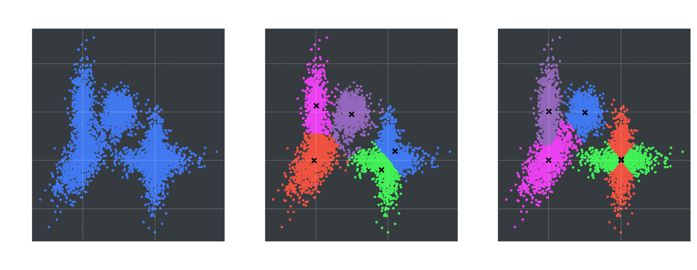

# Machine Learning: Clustering
 
This is a simple implementation of k-Means and Gaussian Mixture Models, which are unsupervised machine learning models used for grouping data into spatially-similar clusters. An example of the result of both clustering models is shown:



## Usage

A `ClusterModel` object can be instanstiated and defined to use either model, by specifying `"kmeans"` or `"GMM"` to `model_type`. The parameter `init_algorithm` instructs the model on how to choose the first centers. If using the `"random"` method, the model will chose `K` random data points to act as centers for the first iteration. The `"max_dist"` algorithm chooses the first center randomly, then picks the remaining centers to be data points that maximize distance from all of the remaining centroids.

N D-dimensional data points in an array `X` with shape (N, D) can be clustered as follows:

```python
kmeans_model = ClusterModel(K = 5, model_type = "kmeans", init_algorithm = "random")
kmeans_model.train(X)
kmeans_labels = kmeans_model.labels
kmeans_centers = kmeans_model.centers

gmm_model = ClusterModel(K = 5, model_type = "GMM", init_algorithm = "max_dist")
gmm_model.train(X)
gmm_labels = gmm_model.labels
gmm_centers = gmm_model.centers
```

## The Theory
### K-Means:

- **Goal:** label each point to one of K clusters such that there is a minimum distance between each point and the mean of their cluster.
- Optimize labels and centroids with block-coordinate descent, holding one parameter fixed per iteration, alternating each time.
  - Reassign data points to the group j with the lowest distance to the centroid 
  - Calculate new group means for each cluster
- K-means fails for non-circular data clusters, overlapping clusters.

### Gaussian Mixture Models (GMM):

- Represents a distribution as a weighted sum of K multivariate normal distributions
- `pi_k` are the mixing coefficients, where the sum of all coefficients is 1
- Uses the expectation maximization algorithm:
  - **E-step:** Compute posterior probability that each gaussian generates each data point
  - **M-step:** Change parameters of the gaussians to maximize the probability of generating the data.
- Succeeds at clustering non-circular and overlapping data clusters, where K-Means fails.
